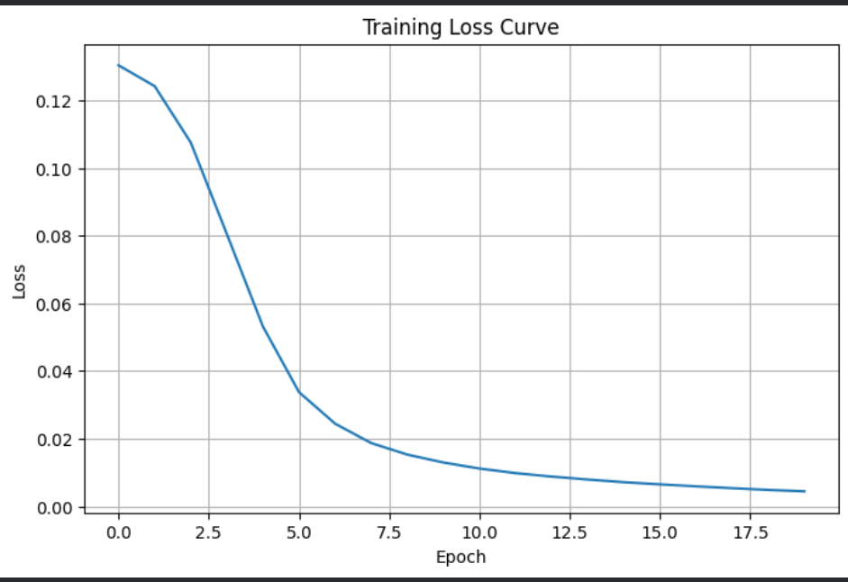
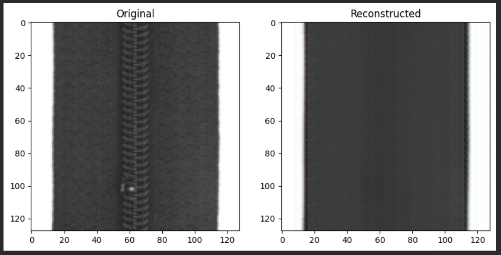
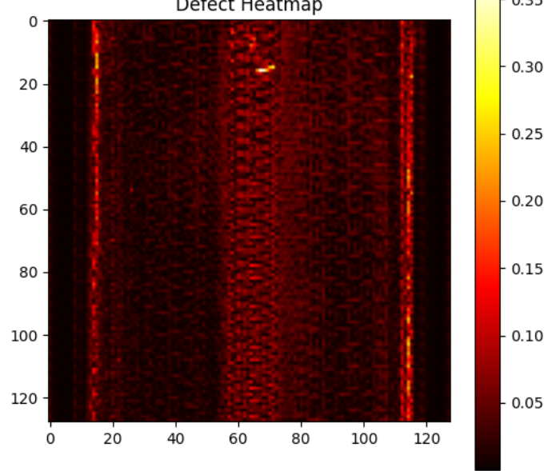
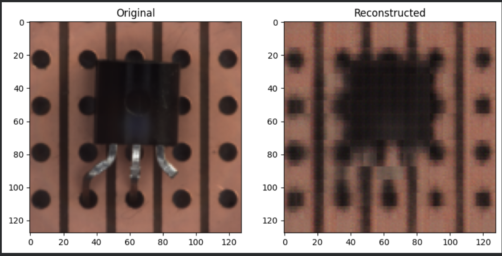
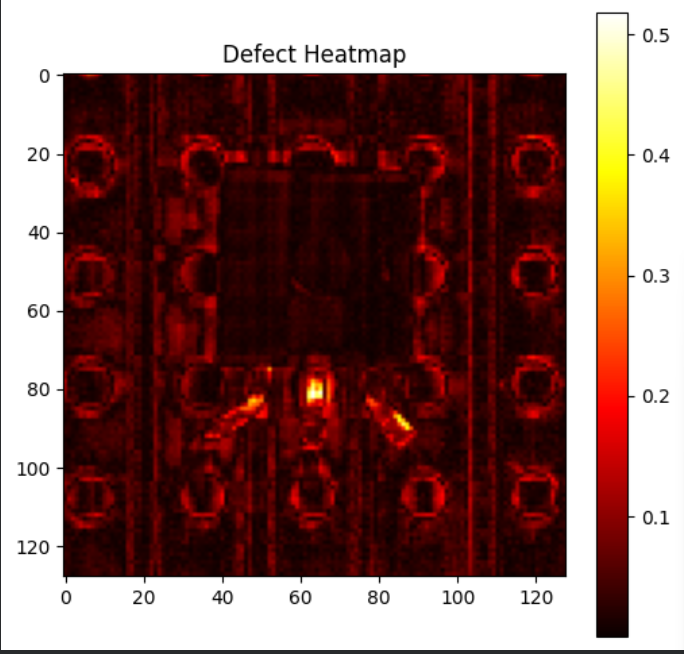
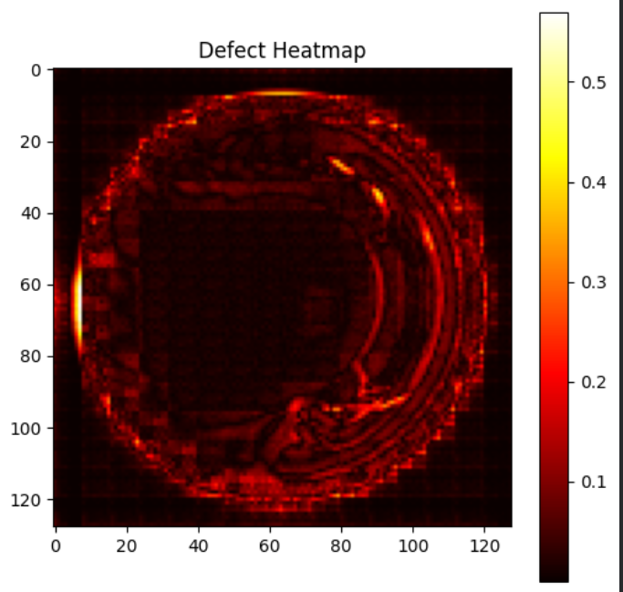

# 🔍 Industrial Defect Detection using Autoencoders

An Unsupervised Deep Learning project for manufacturing quality inspection using Convolutional Autoencoders and reconstruction-error-based anomaly detection.

---

## 📌 Project Overview

Industrial manufacturing requires continuous quality inspection to identify defective products before deployment.

This project uses a **Convolutional Autoencoder** trained only on normal product images. During testing, reconstruction error is used to identify anomalies and defects.

The system was evaluated on multiple categories from the **MVTec Anomaly Detection Dataset**.

### Categories Tested

* Bottle
* Transistor
* Zipper

---

## 🎯 Objectives

* Learn normal product patterns
* Detect defects without defect labels during training
* Visualize anomalies using heatmaps
* Perform unsupervised industrial anomaly detection

---

## 🧠 Methodology

### Training Phase

The Autoencoder is trained only on good-quality product images.

### Reconstruction Phase

The model reconstructs the input image.

### Error Computation

Mean Squared Error (MSE) is calculated between:

* Original Image
* Reconstructed Image

### Decision Rule

If reconstruction error exceeds a threshold:

```text
Defect Detected
```

Otherwise:

```text
Normal Product
```

---

## 🏗️ Architecture

```text
Input Image
      ↓
Encoder
      ↓
Latent Space
      ↓
Decoder
      ↓
Reconstructed Image
      ↓
Reconstruction Error
      ↓
Normal / Defective
```

---

## 📂 Dataset

### MVTec Anomaly Detection Dataset

A benchmark dataset for industrial anomaly detection.

Categories used:

* Bottle
* Transistor
* Zipper

---

## 🛠️ Technologies Used

* Python
* PyTorch
* NumPy
* OpenCV
* Matplotlib
* Scikit-Learn
* Google Colab
* GitHub

---

## 📁 Project Structure

```text
Defect_detectionIn_manufacturing_Using_autoencoder/

│
├── Defect_detection(Bottles)using_AutoEncoder.ipynb
├── Defect_detection(Transistor)using_AutoEncoder.ipynb
├── Defect_detection(Zipper)using_AutoEncoder.ipynb
│
├── Screenshots/
│   ├── bottle_heatmap.png.png
│   ├── bottle_original_reconstructed.png
│   ├── training_loss_curve.png.png
│   ├── transistor_heatmap.png.png
│   ├── transistor_original_reconstructed.png.png
│   ├── zipper_heatmap.png.png
│   └── zipper_original_reconstructed.png.png
│
└── README.md
```

---

# 📊 Results and Visualizations

## 📈 Training Loss Curve

The training loss decreases consistently across epochs, indicating successful learning of normal product patterns.



---

# 🧵 Zipper Defect Detection

## Original vs Reconstructed Image

Comparison between the original zipper image and reconstructed image.



## Defect Heatmap

Highlighted regions indicate reconstruction differences and possible anomalies.



---

# 🔌 Transistor Defect Detection

## Original vs Reconstructed Image

Comparison between original transistor image and reconstructed output.



## Defect Heatmap

Bright regions indicate high reconstruction error.



---

# 🍾 Bottle Defect Detection

## Original vs Reconstructed Image

Comparison between original bottle image and reconstructed image.


## Defect Heatmap

Heatmap visualizing anomaly locations.



---

## 📈 Evaluation Metrics

The model can be evaluated using:

* Accuracy
* Precision
* Recall
* F1 Score
* Reconstruction Error
* Confusion Matrix

---

## 🎯 Key Findings

* Autoencoders successfully learned normal product features.
* Reconstruction error effectively identified anomalies.
* Heatmaps highlighted defect regions.
* The model generalized across multiple industrial categories.
* Unsupervised learning reduced dependency on labeled defect data.

---

## 🚀 Future Improvements

* Variational Autoencoders (VAE)
* GAN-based Anomaly Detection
* Vision Transformers (ViT)
* Diffusion Models
* Streamlit Deployment
* Real-Time Inspection Systems

---

## 📚 Applications

* Manufacturing Quality Control
* Electronics Inspection
* Semiconductor Defect Detection
* Packaging Inspection
* Industrial Automation

---

## 👨‍💻 Author

**Aditya Sikarwar**

B.Tech Artificial Intelligence Engineering

Industrial Defect Detection using Deep Learning and Autoencoders

---

## ⭐ Acknowledgements

* PyTorch
* Google Colab
* MVTec AD Dataset
* Open Source Computer Vision Community
