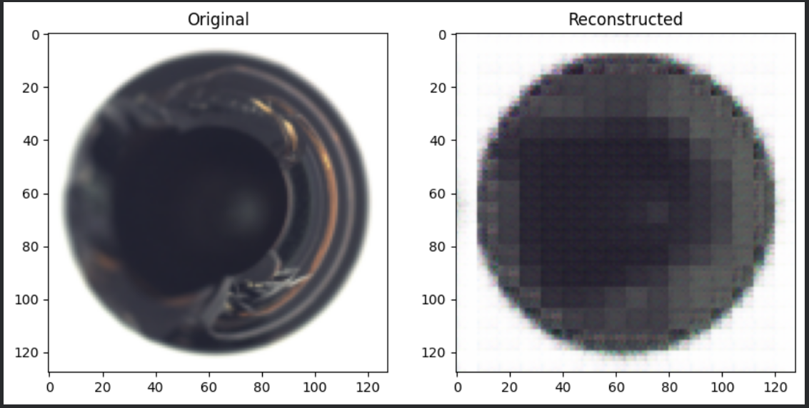

# 🔍 Industrial Defect Detection using Autoencoders

An Unsupervised Deep Learning project for manufacturing quality inspection using Convolutional Autoencoders and reconstruction-error-based anomaly detection.

## Dataset

MVTec Anomaly Detection Dataset

## Technologies Used

- Python
- PyTorch
- NumPy
- Matplotlib
- OpenCV
- Scikit-Learn
- Google Colab

## Categories Tested

- Bottle
- Transistor
- Zipper

# 📊 Results and Visualizations

The Autoencoder was trained on normal product images and evaluated on multiple categories from the MVTec Anomaly Detection Dataset.

---

# 📈 Training Loss Curve

The training loss decreases steadily across epochs, indicating successful learning of normal product features.

---

# 🧵 Zipper Defect Detection

## Original vs Reconstructed Image

The reconstructed image preserves the overall structure while smoothing fine details.

## Defect Heatmap

Regions with higher reconstruction error are highlighted as potential defects.

---

# 🔌 Transistor Defect Detection

## Original vs Reconstructed Image

Comparison between the original transistor image and the reconstructed output generated by the Autoencoder.

## Defect Heatmap

Bright regions indicate locations with higher reconstruction error and possible anomalies.

---

# 🍾 Bottle Defect Detection

## Original vs Reconstructed Image

The Autoencoder reconstructs the bottle image while preserving major structural features.

## Defect Heatmap

The heatmap highlights regions where reconstruction error is highest.

---

# 🎯 Conclusion

The Convolutional Autoencoder successfully learned normal product patterns and detected anomalies using reconstruction error.

### Key Findings

- Training loss decreased consistently.
- Normal samples produced low reconstruction errors.
- Defective samples produced higher reconstruction errors.
- Heatmaps successfully localized anomalous regions.
- The model generalized across multiple industrial categories.

### Categories Evaluated

- Bottle
- Transistor
- Zipper

This demonstrates the effectiveness of unsupervised anomaly detection for industrial quality inspection.
